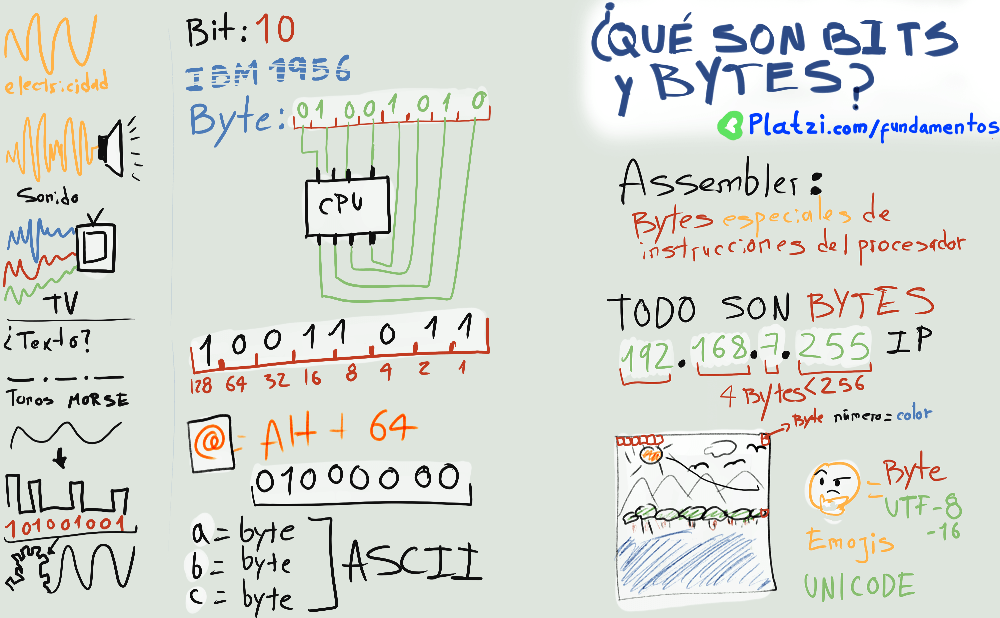

# ¿Qué es el sistema binario?
Es un sistema de numeración que está representado por uno (1) y cero (0)

El 1 y 0 representan diferentes valores:
- Hay corriente = 1
- No hay corriente = 0
- Positivo (+) = 1
- Negativo (-) = 0
- True = 1
- False = 0

### Reto: 
Encuentra el año de tu nacimiento en el **sistema binario**.

### Platzi Materiales Relacionados a esta clase:
- [Fundamentos de Ingeniería de Software](https://platzi.com/clases/ingenieria)
- [Video: Qué son Bits y Bytes](https://platzi.com/clases/1098-ingenieria/6549-que-son-bits-y-bytes)
- [Blog: Qué son Bits y Bytes](https://platzi.com/clases/2218-pensamiento-logico/35632-que-son-bits-y-bytes)

### Continuar Leyendo:
- [Capitulo Anterior: ¿Qué es el sistema binario?](./02_que_entiende_una_computadora.md)
- [Siguiente Capitúlo: Metodología para construir un algoritmo: requerimientos y proceso mental](04_requerimientos_procesos_mentales.md)