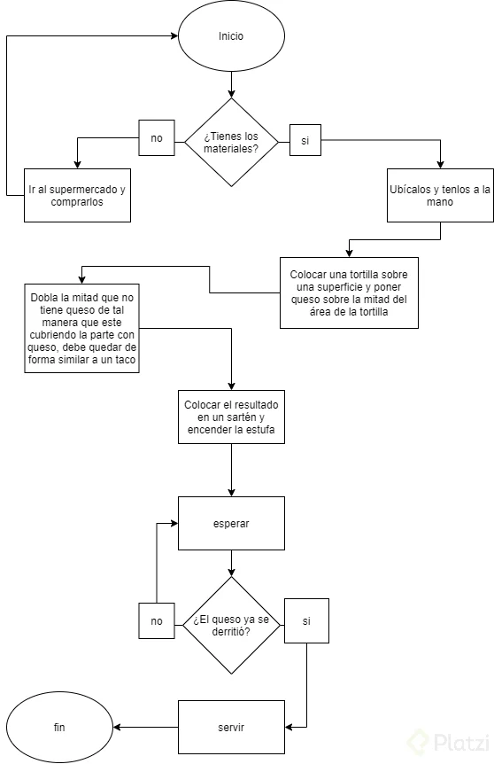

# Metodología para construir un algoritmo: requerimientos y proceso mental

Un algoritmo son pasos para encontrar una solución a problemas simples o complejos.

### Características de un algoritmo:

- Preciso: Paso a paso en un orden lógico
- Definido: Todas la veces que pasemos por el da el mismo resultado
- Finito: Tenemos un proceso de inicio y de cierre

### Los algoritmos los podemos representar de manera:

- Gráfica: A través de diagramas de flujo.
- No gráfica: Se usa un lenguaje de programación, o de manera textual.

### Pasos para hacer un Algoritmo:

- 1.Define un problema
- 2.Analiza el problema
- 3.Diseña el algoritmo
- 4.Prueba de escritorio

### Algortimo de las Quesadillas:

- 1.Poner la tortilla en un plato
- 2.Poner el jamón sobre la tortilla
- 3.Poner los acompañantes del jamon
- 4.Doblar a la mitad la tortilla
- 5.Calentar la tortilla
- 6.Comer

### Continuar Leyendo:

- [Capitulo Anterior: ¿Qué es el sistema binario?](./03_sistema_binario.md)
- [Siguiente Capitúlo: Qué son variables, constantes y tipos de datos?](./../02_tipos_De_datos_operadores_logicos/05_variables_constantes_tipos_datos.md)
