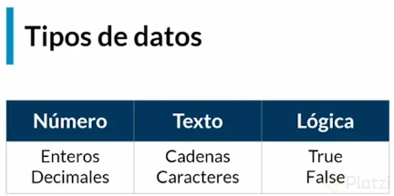

## Variables y Constantes

Una variable es aquella que **puede cambiar su valor**, en cambio una constante
es donde **persiste el valor**.

Una analogía muy usada para describir a las variables es una Caja:

Una caja puede **guardar cualquier cosa dentro**, puedes **meter y sacar
cosas**, etc.

## Tipos de Datos

Ejemplos:

- Entero: 5, 2, 4, 3 ,1.
- Decimales: 3.2 , 6,5
- Cadenas: “Hola”, “hey”, “si”
- Lógica: “True” , “False”

### Continuar Leyendo:

- [Capitulo Anterior: Requerimientos y Proceso Mental](./../01_IntroduccionAlgoritmos/04_requerimientos_procesos_mentales.md)
- [Siguiente Capitúlo: Qué son variables, constantes y tipos de datos?](./../02_tipos_De_datos_operadores_logicos/05_variables_constantes_tipos_datos.md)
