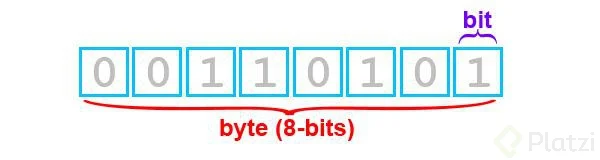

# ¿Qué son Bits y Bytes?

El término **“bit”** es el acrónimo de “binary digit”, que hace referencia a los
dígitos binarios que le indican a nuestro ordenador que hay o no carga de
corriente.

La definición de **bytes** concluye que un byte son el conjunto de 8 bits y que
a su vez representan el valor de una letra. Sin embargo su valor y significado
va más allá de eso, porque de estos 8 bits, 7 son de información y uno adicional
es de control.

