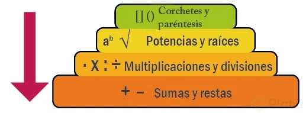
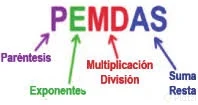

# Operaciones matemáticas compuestas: paréntesis y orden de evaluación

La inmensa mayoría de lenguajes de programación obedecen la jerarquía de opearicones matemáticas, también se les llama orden de precedencia, les dejo esta imagen donde se explica cuál es la precedencia más importante que se suele resolver primero 😄 Recordemos que todo lo que está entre paréntesis será lo que se resuelva primero.



En otras palabras, en cualquier problema de matemáticas debes empezar resolviendo primero los paréntesis, luego los exponentes, luego las multiplicaciones y divisiones y luego las sumas y restas. Cuando las operaciones son del mismo nivel, se resuelven de izquierda a derecha. Por ejemplo, si el cálculo contiene más de un exponente, debes resolver primero el que esté más a la izquierda y continuar hacia la derecha.



📌 Los paréntesis nos permiten agrupar expresiones, alterar la precedencia normal de los operadores y su asociatividad.

```
//Procedencia normal
resultado = 5 - (3 * 2) + 4 - (4 / 2);
//Procedencia alterada
resultado = (5 - 3) * 2 + (4 - 4) / 2;
```
